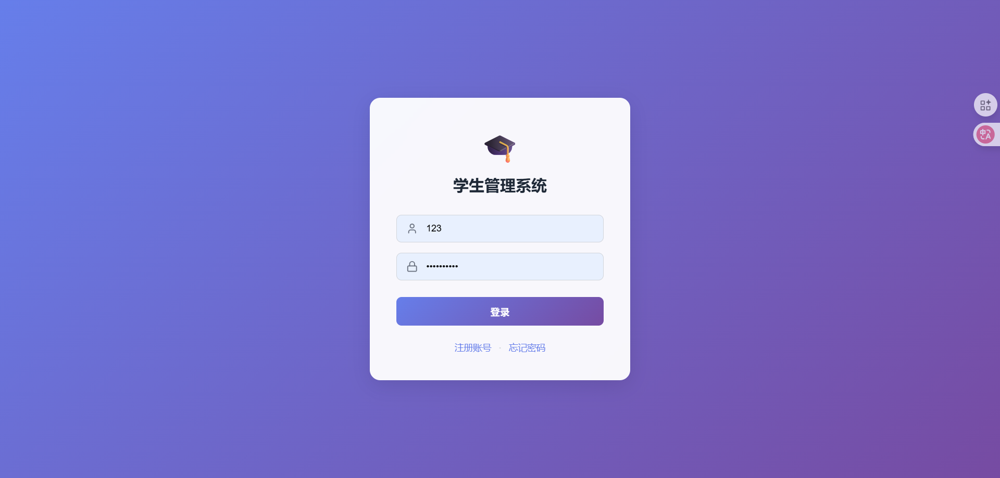
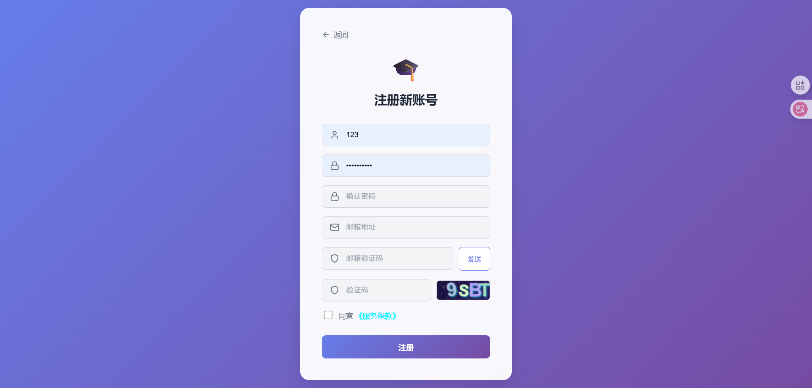
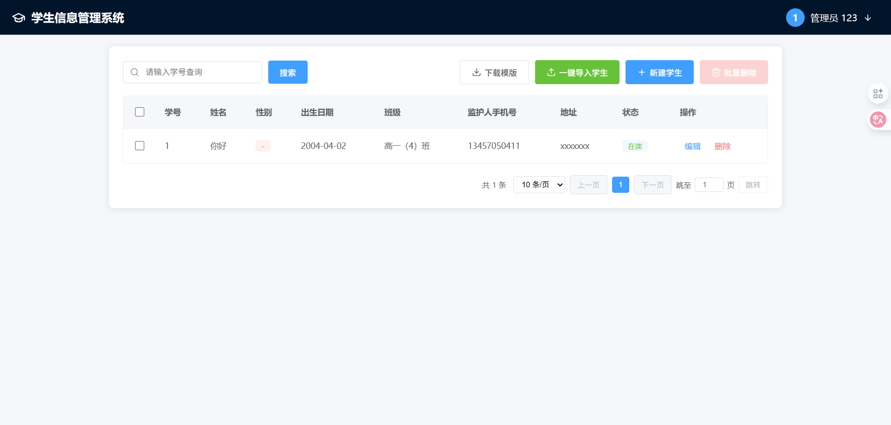
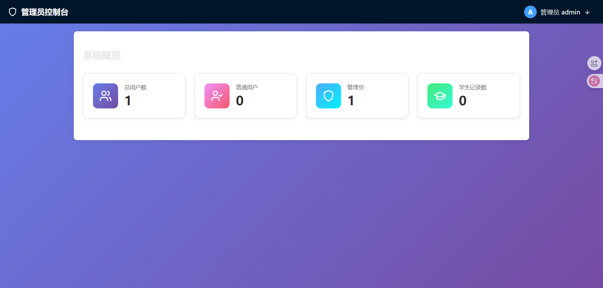

# 🎓 学生信息管理系统 (Student Information System)

<div align="center">


一个基于 **Spring Boot + React** 的现代化前后端分离学生管理系统


</div>

---

## 📖 项目简介

这是一个完整的前后端分离学生管理系统，采用现代化的技术栈和架构设计，实现了用户认证、学生信息管理、数据隔离、角色权限控制等核心功能。项目适合作为学习 Spring Boot + React 全栈开发的实战案例。

### ✨ 为什么选择这个项目？

- 🏗️ **完整的前后端分离架构**：前端 React + 后端 Spring Boot，职责清晰
- 🔐 **企业级安全方案**：JWT + Spring Security，邮箱验证码注册
- 🎨 **现代化 UI 设计**：简约紫色风格，响应式布局
- 📊 **数据隔离设计**：多用户独立数据管理，保证数据安全
- 🔑 **角色权限控制**：管理员与普通用户权限分离
- 📦 **开箱即用**：详细的配置文档，快速启动项目

---
## 📸 截图预览

### 登录页面


### 注册页面


### 学生管理页面


### 管理员控制台


---

## 🎯 功能特性

### 核心功能

#### 👤 用户认证
- ✅ JWT Token 认证机制
- ✅ 用户注册（邮箱验证码 + 图形验证码）
- ✅ 角色判断与智能路由跳转
- ✅ 密码 BCrypt 加密存储
- ✅ 防刷机制（失败锁定）

#### 📚 学生管理
- ✅ 学生信息 CRUD 操作
- ✅ 分页查询与按学号搜索
- ✅ Excel 批量导入
- ✅ 用户独立数据
- ✅ 学号唯一性校验

#### 🔐 权限控制
- ✅ 基于角色的访问控制
- ✅ 管理员控制台
- ✅ 普通用户工作区
- ✅ API 接口权限拦截

#### 📝 待办事项
- ✅ 个人 Todo 管理
- ✅ 状态切换与删除
- ✅ 简洁直观的界面

---

---

## 🚀 快速开始

### 环境要求

- ☕ **JDK**: 17+
- 🔧 **Maven**: 3.6+
- 🗄️ **MySQL**: 8.0+（生产环境）
- 📦 **Node.js**: 16+
- 🎨 **npm**: 8+

### 1️⃣ 克隆项目

```bash
git clone https://github.com/your-username/student-system.git
cd student-system
```

### 2️⃣ 后端启动

#### 方式一：使用 H2 测试环境（推荐新手）

```bash
# 无需配置数据库，直接运行
mvn spring-boot:run -Dspring-boot.run.profiles=dev
```

后端运行在：`http://localhost:8081`

#### 方式二：使用 MySQL 生产环境

**① 创建数据库**
```sql
CREATE DATABASE sis_db CHARACTER SET utf8mb4 COLLATE utf8mb4_unicode_ci;
```

**② 配置数据库连接**

编辑 `src/main/resources/application.properties`：
```properties
spring.datasource.url=jdbc:mysql://localhost:3306/sis_db
spring.datasource.username=your_username
spring.datasource.password=your_password
```

**③ 配置邮件服务（可选）**
```properties
spring.mail.host=smtp.qq.com
spring.mail.port=587
spring.mail.username=your_email@qq.com
spring.mail.password=your_authorization_code
```

**④ 启动后端**
```bash
mvn spring-boot:run
```

后端运行在：`http://localhost:8080`

### 3️⃣ 前端启动

```bash
cd frontend

# 安装依赖
npm install

# 启动开发服务器
npm run dev
```

前端运行在：`http://localhost:3000`

### 4️⃣ 访问系统

#### 测试环境默认账户

系统启动后会自动创建管理员账户：
- **用户名**：`admin`
- **密码**：`admin123`
- **角色**：ROLE_ADMIN

#### 访问地址

- 🌐 前端界面：http://localhost:3000
- 🔌 后端 API：http://localhost:8080（MySQL）或 http://localhost:8081（H2）
- 🗄️ H2 控制台：http://localhost:8081/h2-console（测试环境）

---


## 🎓 学习要点

通过这个项目，你可以学习到：

### 后端部分
- ✅ Spring Boot 3.x 项目搭建与配置
- ✅ Spring Security + JWT 认证实现
- ✅ Spring Data JPA 数据持久化
- ✅ RESTful API 设计规范
- ✅ 全局异常处理
- ✅ 数据隔离与权限控制
- ✅ 邮件发送与验证码机制
- ✅ Excel 文件处理

### 前端部分
- ✅ React 18 Hooks 开发
- ✅ React Router 6 路由配置
- ✅ Axios 拦截器与 Token 管理
- ✅ JWT 解析与角色判断
- ✅ 表单验证与错误处理
- ✅ 文件上传与下载
- ✅ 响应式布局设计

---

## 🔧 配置说明

### 双配置文件设计

项目支持多环境配置，方便开发与部署：

| 配置文件 | 环境 | 数据库 | 端口 | 说明 |
|---------|------|--------|------|------|
| `application.properties` | 生产 | MySQL | 8080 | 需手动配置数据库 |
| `application-dev.properties` | 测试 | H2 | 8081 | 内存数据库，自动初始化 |

### 关键配置项

```properties
# JWT 配置
jwt.secret=your_secret_key_here
jwt.expiration=86400000  # 24小时

# 管理员自动创建（仅测试环境启用）
app.init.enabled=true

# 邮件配置
spring.mail.host=smtp.qq.com
spring.mail.port=587
spring.mail.username=your_email@qq.com
spring.mail.password=your_authorization_code
```

---


## 🐛 常见问题

### Q1: 启动后端报错 "Access denied for user"？
**A**: 检查 `application.properties` 中的数据库用户名和密码是否正确。

### Q2: 前端无法连接后端接口？
**A**: 确认后端是否启动成功，检查 `src/services/api.js` 中的 `BASE_URL` 配置。

### Q3: 注册时收不到验证码？
**A**: 需要在 `application.properties` 中配置你的邮件服务器信息。

### Q4: H2 数据库数据丢失？
**A**: H2 是内存数据库，重启后数据会清空，生产环境请使用 MySQL。

### Q5: 管理员账户在 MySQL 环境下不存在？
**A**: 生产环境已禁用自动创建，请参考后端文档手动创建管理员。

---

---

## ⭐ Star History

如果这个项目对你有帮助，请给个 Star ⭐ 支持一下吧！

---

<div align="center">

**Made with ❤️ by [liang]**

[⬆ 回到顶部](#-学生信息管理系统-student-information-system)

</div>

